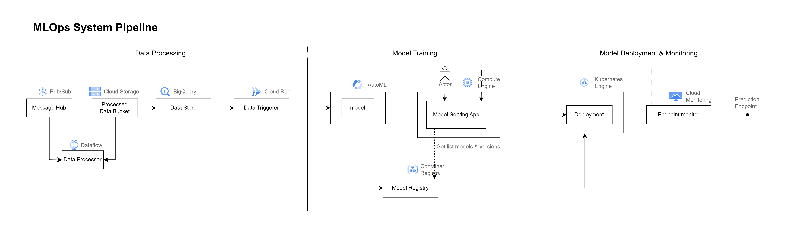

# MlOps-Cloud

Code và file cấu hình cho thực nghiệm: Xây dựng hệ thống huấn luyện và triển khai học máy trên Google Cloud.
- Lớp học phần: Điện toán đám mây 
- Giảng viên hướng dẫn: TS. Phạm Mạnh Linh

 

### Tổng quan hệ thống

Toàn hệ thống có thể được chia thành ba pha chính:
- Xử lý dữ liệu (Data Processing)
- Huấn luyện mô hình (Model Training)
- Triển khai và theo dõi mô hình (Model Deployment & Monitoring.

  

**Pha 1: Tiền xử lý dữ liệu**

Mục đích của pha này là tiền xử lý dữ liệu thô đầu vào, lưu trữ lại và chuẩn bị dữ liệu đầu vào cho mô hình. Các công cụ được sử dụng cho pha này bao gồm:
- **Pub/Sub**: Đóng vai trò như một Message Hub, mỗi khi có dữ liệu mới được gửi đến, Pub/Sub có vai trò “lắng nghe” và gửi lại dữ liệu này real-time tới Dataflow để xử lý.
- **Dataflow**: Xử lý dữ liệu thô được gửi đến theo các pipeline được định nghĩa sẵn, bao gồm các bước làm sạch và biến đổi dữ liệu trước khi lưu lại vào bucket Processed.
- **Cloud Storage**: nguồn lưu trữ dữ liệu, trong luồng này được sử dụng làm nguồn lưu trữ tạm thời để lưu các dữ liệu đã được xử lý từ Dataflow, trước khi được đưa vào BigQuery.
- **BigQuery**: Các dữ liệu sau khi đã được xử lý ở Dataflow và lưu trữ tạm thời ở Cloud Storage sẽ được chuyển tới đây và lưu dưới dạng có cấu trúc, sẵn sàng cho việc huấn luyện.
- **Cloud Run**: Được sử dụng để làm data triggered, được cấu hình sẵn sẽ giúp hệ thống tự động huấn luyện lại mô hình theo một thời gian nhất định, đảm bảo tính liên tục của hệ thống. Ví dụ: sau mỗi 1 ngày, các dữ liệu mới được đổ về BigQuery, Cloud Run này sẽ được kích hoạt và khởi động quá trình huấn luyện mô hình ở AutoML.

**Pha 2: Huấn luyện mô hình**

Mục đích của pha này là từ dữ liệu được cung cấp, huấn luyện mô hình được chỉ định, lưu lại các phiên bản và cho phép người dùng lựa chọn triển khai. Các công cụ được sử dụng cho pha này bao gồm:
- **AutoML**: Hỗ trợ tự động hóa quá trình huấn luyện và tối lưu mô hình với các thuật toán tiên tiến mà người dùng không cần can thiệp hoặc cấu hình sâu trong mã nguồn.
- **Container Registry**: Sau khi đã được huấn luyện xong trong pipeline của AutoML, các mô hình mới sẽ được đưa vào Container Registry và được quản lý theo mô hình (pipeline huấn luyện) và theo phiên bản.
- **Compute Engine**: Compute Engine được sử dụng để triển khai ứng dụng portal của hệ thống. Ở giao diện portal, người dùng có thể:
    - <u>Theo dõi tổng quan hệ thống</u>: ở giao diện trang chủ, người dùng có thể theo dõi được các thông số tổng quan hệ thống: số lượng deployment, tình trạng các deployment, lượng tài nguyên hạ tầng đã sử dụng.
    - <u>Triển khai mô hình</u>: Người dùng lựa chọn loại mô hình và phiên bản đã được huấn luyện, cấu hình thêm các thông số liên quan và ấn triển khai.
    - <u>Theo dõi các mô hình đã được triển khai</u>: người dùng có thể vào trang Deployment Detail để xem chi tiết một mô hình đã được triển khai, bao gồm trạng thái triển khai, endpoint url, các số lượng sử dụng (usage metrics) của người dùng cuối, log của ứng dụng dưới hạ tầng. Từ đó dễ dàng nắm bắt được các thông tin triển khai và điều chỉnh khi cần thiết.

**Pha 3: Triển khai và theo dõi mô hình**

Mục đích của pha này là triển khai mô hình xuống hạ tầng kubernetes, đồng thời theo dõi, quản lý các endpoint của mô hình. Các công cụ được sử dụng cho pha này bao gồm:
- **Kubernetes Engine**: Ngay khi người dùng cấu hình các tham số và lựa chọn triển khai mô hình ở giao diện của Portal, các thông tin được gửi xuống và triển khai dưới dạng Deployment trong Kubernetes Engine, Deployment này sẽ kéo (pull) image từ Container Registry về và triển khai trên các pod với số lượng bản sao (replica) tương ứng. Nhóm lựa chọn K8s làm hạ tầng triển khai nhằm đảm bảo khả năng mở rộng và phục vụ dự đoán với độ trễ thấp. 
- **Cloud Monitoring**: Khi mô hình được triển khai dưới môi trường kubernetes và được expose dưới dạng các cổng (port). Cloud Monitoring được sử dụng để theo dõi hiệu suất, độ ổn định, lượng người dùng của mô hình đó sau khi triển khai, cung cấp các chỉ số quan trọng như độ chính xác, độ trễ, lượng sử dụng và tài nguyên sử dụng.

### Tổng kết

Hệ thống MLOps trên Google Cloud Platform nhóm đề xuất được thiết kế linh hoạt và tận dụng tối đa các dịch vụ của Google Cloud để tự động hóa vòng đời của quá trình. Hệ thống cung cấp giải pháp MLOps hoàn chỉnh, hiệu quả, và đáng tin cậy cho việc xây dựng và triển khai các mô hình học máy ở môi trường sản xuất ở các doanh nghiệp.

Với thực nghiệm đã thực hiện, nhóm đã đưa ra đề xuất triển khai hệ thống học máy hoàn chỉnh trên nền tảng điện toán đám mây của Google Cloud Platform. Hệ thống đi từ các pha cơ bản xử lý dữ liệu, huấn luyện mô hình và triển khai mô hình, không chỉ làm rõ vai trò, ứng dụng của các dịch vụ cloud của Google Cloud Platform mà còn là một nguồn tài liệu tham khảo hệ thống mang tính ứng dụng cao đối với doanh nghiệp khi sử dụng.

### Sinh viên thực hiện thực nghiệm
- 21020035 - Nguyễn Huy Thái
- 22028131 - Lê Xuân An
- 22028190 - Lê Minh Quý

 